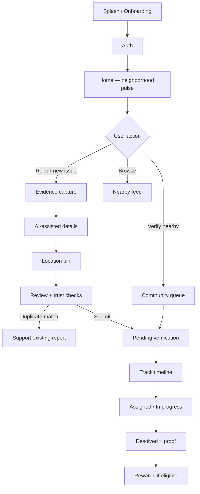
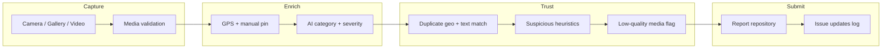
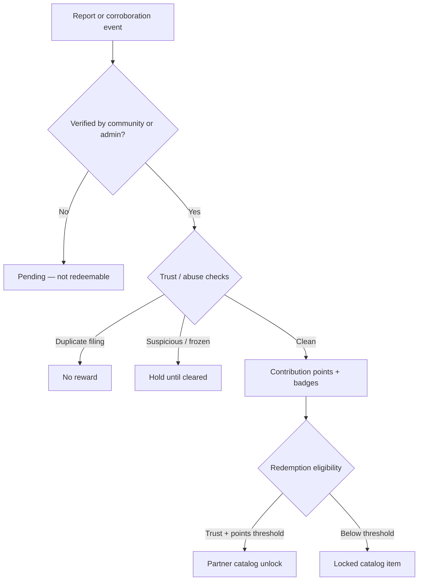
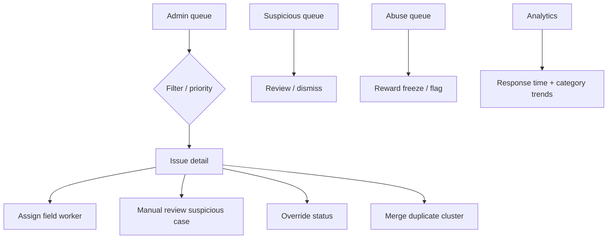

# CivicResolve

**Community-powered civic infrastructure reporting — identify, report, validate, track, and resolve local issues with accountability.**

[](https://www.typescriptlang.org/)
[](https://react.dev/)
[](https://vitejs.dev/)
[](./src/test)

---

## Overview

Cities depend on residents to surface problems early — potholes near schools, water leaks at apartment blocks, broken streetlights in residential lanes, and waste accumulating near markets. Today, most reporting channels are **fragmented** (phone lines, social media, ward offices), **opaque** (no status after submission), and **easy to game** (duplicate noise, low-signal complaints).

**CivicResolve** is a mobile-first web platform that turns civic reporting into a **structured, verifiable, trackable workflow**. Citizens capture photo or short-video evidence with geolocation, receive AI-assisted categorization, are steered toward supporting existing reports when duplicates are detected, and earn recognition only for **verified** contribution. Administrators operate from a unified dashboard with moderation, analytics, and assignment tooling.

> **MVP scope:** The shipped prototype uses **mock-backed services** by default (in-memory data, demo auth). Live Supabase/Firebase, Mapbox tiles, and Grok AI are wired through adapter interfaces and optional environment configuration. See [Known limitations](#known-limitations-mvp).

---

## Problem statement

| Challenge | Impact |
|-----------|--------|
| **Fragmented reporting** | Issues are filed across channels with no single source of truth. |
| **Poor visibility** | Residents cannot see whether a report was received, verified, or acted on. |
| **Weak accountability** | Municipal response lacks transparent timelines and resolution proof. |
| **Low community signal** | Duplicate filings dilute urgency; honest corroboration is undervalued. |
| **Abuse and noise** | Point systems without trust guardrails incentivize spam over impact. |

CivicResolve addresses these by making **trust, verification, and resolution state** visible in the product — not hidden in backend-only rules.

---

## Product vision

1. **Mobile-first reporting** — One-handed evidence capture outdoors; gallery and camera fallbacks when permissions are denied.
2. **AI-assisted intake** — Category, severity hints, and duplicate risk accelerate submission without blocking when AI is unavailable.
3. **Community validation** — Neighbors corroborate issues they can observe; corroboration raises crew confidence.
4. **Transparent tracking** — Status timelines from submission through verification, assignment, and resolution.
5. **Trust-based gamification** — Points, badges, and partner perks follow **verified** impact, not report volume.

---

## Key features

### Citizen experience

- **Image and short-video reporting** with validation (type, size, duration) and preview
- **Geolocation** with manual pin correction when GPS is denied or imprecise
- **AI categorization and copy suggestions** (mock or Grok via env)
- **Severity estimation** and editable report details before submit
- **Duplicate detection** with support-existing-report routing (not punitive blocking)
- **Suspicious-report quality checks** framed as protective review, not accusation
- **Community verification** queue for pending reports
- **Status tracking** with issue timelines and resolution proof placeholders
- **Rewards, trust score, badges, streaks** — redeemable only after verification
- **Youth / family supervised mode** with capped rewards and no partner redemption

### Operations (admin)

- **Issue queue** with category, severity, and status filters
- **Issue detail** with moderation, assignment, and field-crew timeline
- **Suspicious and abuse review queues**
- **Duplicate merge tooling**
- **Analytics** — response-time metrics, category trends, predictive insight cards (seed/heuristic in MVP)
- **Hotspot map** — ward-level concentration views (mock map layer in MVP)

---

## User roles

| Role | Primary surface | Capabilities |
|------|-----------------|--------------|
| **Citizen** | `/app/*` | Report, track, verify nearby, rewards |
| **Community verifier** | `/app/community`, `/app/nearby` | Corroborate issues; one confirmation per user per report |
| **Admin / moderator** | `/admin/*` | Queue triage, moderation, analytics, assignment |
| **Field worker** | Seed data + admin timelines | Assignment and on-site updates (demo accounts) |
| **Youth / family** | `/app/family`, supervised flows | Report with restrictions; parent-managed rewards |

**Demo sign-in** (no password): see [Quick start](#quick-start).

---

## End-to-end product flow

```
Onboarding → Auth → Home
    → Report: Evidence → Details → Location → Review → Submit
    → Community verification → Status progression → Resolution
    → Rewards (if verified) → Return engagement
```

**Parallel paths:** Support existing report (duplicate nudge) · Admin moderation · Abuse review

---

## Flow diagrams

### User journey



### Reporting pipeline



### Trust and reward logic



### Admin moderation flow



---

## System architecture

```
┌─────────────────────────────────────────────────────────────────┐
│                    Vite SPA (React 19 + TypeScript)              │
│  ┌─────────────────────┐    ┌──────────────────────────────┐  │
│  │ Citizen routes       │    │ Admin routes                  │  │
│  │ /app/home, report,   │    │ /admin/dashboard, queue,      │  │
│  │ community, rewards   │    │ moderation, analytics         │  │
│  └──────────┬──────────┘    └──────────────┬───────────────┘  │
│             │         React Router guards    │                  │
│  ┌──────────▼──────────────────────────────▼───────────────┐  │
│  │ Zustand stores (auth, onboarding, report draft)             │  │
│  └──────────┬──────────────────────────────────────────────┘  │
└─────────────┼──────────────────────────────────────────────────┘
              │
┌─────────────▼──────────────────────────────────────────────────┐
│  services/registry.ts — env-selected adapters                     │
│  ┌────────────┐ ┌────────────┐ ┌──────────┐ ┌─────────────────┐ │
│  │ mockAuth   │ │ mockReports│ │ mockAI   │ │ mockMaps        │ │
│  │ mockBackend│ │ mockMedia  │ │ grokAI*  │ │ mapboxMaps*     │ │
│  └────────────┘ └────────────┘ └──────────┘ └─────────────────┘ │
│  * optional live providers · supabase/firebase stubs (Phase 2)   │
└─────────────┬────────────────────────────────────────────────────┘
              │
┌─────────────▼────────────────────────────────────────────────────┐
│  domain/ — pure TypeScript (trust, duplicates, rewards, admin)   │
└──────────────────────────────────────────────────────────────────┘
```

| Layer | Implementation |
|-------|----------------|
| **Frontend** | React 19, React Router 7, lazy-loaded feature pages |
| **State** | Zustand (`authStore`, `onboardingStore`, `reportDraftStore`) |
| **Services** | Adapter pattern in `src/services/` + `registry.ts` |
| **AI** | `mockAI` (default) · `grokAI` + `resilientAI` fallback |
| **Maps / location** | `mockMaps` (default) · Mapbox adapter when token set |
| **Backend** | `mockBackend` (default) · Supabase/Firebase stubs |

---

## Data and AI pipeline

| Stage | Module | MVP behavior |
|-------|--------|--------------|
| **Media input** | `EvidenceStep`, `media-validation.ts` | File type, size, duration checks; IndexedDB draft blobs |
| **Metadata** | `video-metadata.ts`, geolocation adapter | Duration extraction; GPS or manual pin |
| **AI categorization** | `useReportAIAssist`, `mockAI` / `grokAI` | Category, title, description suggestions |
| **Duplicate detection** | `domain/duplicate-detection.ts` | Geo + keyword scoring; review-step warning |
| **Fake / suspicious checks** | `domain/suspicious-report.ts` | Heuristics: velocity, media quality, text-only |
| **Moderation routing** | `mockAdmin`, admin queues | Suspicious cases, abuse flags, merge tool |
| **Reward eligibility** | `domain/reward-eligibility.ts`, `abuse-eligibility.ts` | Verified-only points; freeze on abuse signals |

AI **never blocks submission** — unavailable Grok falls back to mock suggestions and manual entry.

---

## Trust and safety architecture

| Mechanism | UX surface | Domain logic |
|-----------|------------|--------------|
| **Duplicate handling** | Review warning, nearby nudge, merge notice | `duplicate-detection`, admin merge |
| **Suspicious flags** | Protective review notice on issue detail | `suspicious-report`, admin queue |
| **Reward abuse** | Frozen catalog, abuse review queue | `abuse-eligibility`, velocity flags |
| **Community validation** | Verify tab, corroborate actions | `mockCorroboration`, trust updates |
| **Youth restrictions** | Family mode caps, no redemption | `youth-restrictions.ts` |

Detailed rules: [`trust-and-safety.md`](./trust-and-safety.md) · [`moderation-rules.md`](./moderation-rules.md)

---

## Technical stack

| Category | Technology |
|----------|------------|
| **Frontend** | React 19, TypeScript 5.7, Vite 6 |
| **Routing** | React Router 7 |
| **Styling** | Tailwind CSS 3, design tokens, Radix UI primitives |
| **State** | Zustand 5 |
| **Testing** | Vitest 3, React Testing Library, Playwright |
| **AI** | Grok API (optional) via `grok-client.ts` |
| **Deployment** | Vercel-ready (`vercel.json` SPA rewrites) · static `dist/` |

---

## Project structure

```
src/
├── app/                 # App bootstrap (BrowserRouter, hydration)
├── routes/              # Citizen + admin route tables
├── layouts/             # CitizenShell, AdminShell, auth guards
├── features/            # Page modules
│   ├── home/            # Neighborhood pulse, nearby preview
│   ├── reporting/       # 4-step wizard + media components
│   ├── verification/    # Community confirm queue
│   ├── feed/            # Nearby issues, issue detail
│   ├── tracking/        # My reports
│   ├── rewards/         # Points, catalog, badges
│   ├── youth-mode/      # Supervised family mode
│   ├── onboarding/      # Splash, permissions, auth
│   └── admin-*/         # Dashboard, queue, moderation, analytics
├── components/          # Shared UI (cards, states, rewards, admin)
├── domain/              # Pure business logic (no I/O)
├── services/
│   ├── mock/            # Default MVP implementations
│   ├── ai/              # mockAI, grokAI, resilient wrapper
│   ├── maps/            # mockMaps, mapboxMaps
│   ├── supabase/        # Phase 2 stub
│   └── firebase/        # Phase 2 stub
├── store/               # Zustand stores
├── lib/                 # Constants, feature flags, validation
└── test/
    ├── unit/            # Domain and utility tests
    ├── component/       # Page and component tests
    ├── integration/     # Multi-step flow tests
    └── e2e/             # Playwright happy paths
```

**Documentation:** [`FINAL_HANDOFF.md`](./FINAL_HANDOFF.md) · [`architecture.md`](./architecture.md) · [`judge-demo-script.md`](./judge-demo-script.md)

---

## Quick start

### Prerequisites

- Node.js **20+**
- npm **10+**

### Install

```bash
git clone https://github.com/parthkapoor2402/CODING-NINJAS-HACKATHON-SUBMISSION.git
cd CODING-NINJAS-HACKATHON-SUBMISSION
npm install
```

### Environment setup

```bash
# macOS / Linux
cp .env.example .env

# Windows PowerShell
Copy-Item .env.example .env
```

No API keys are required for the default demo. See [Environment variables](#environment-variables).

### Run locally

```bash
npm run dev
```

Open **http://localhost:5173**

| Route | Purpose |
|-------|---------|
| `/auth` | Demo sign-in |
| `/app/home` | Citizen home |
| `/app/report` | Report wizard |
| `/app/community` | Verification queue |
| `/admin/dashboard` | Admin KPIs |

### Demo accounts

| Role | Email | Action on `/auth` |
|------|-------|-------------------|
| Citizen | `demo-citizen@local.dev` | Continue as citizen |
| Admin | `demo-admin@local.dev` | Admin demo |
| Youth | `demo-youth@local.dev` | Youth demo |
| Parent | `demo-parent@local.dev` | Parent demo |

### Run tests

```bash
# All Vitest (175 tests)
npm test

# By layer
npm run test:unit
npm run test:component
npm run test:integration

# E2E (24 tests — install browser once)
npx playwright install chromium
npm run test:e2e
```

### Build

```bash
npm run build
npm run preview
```

Output directory: **`dist/`**

---

## Environment variables

Copy from [`.env.example`](./.env.example). **Never commit `.env`.**

| Variable | Default | Description |
|----------|---------|-------------|
| `VITE_APP_NAME` | `CivicResolve` | Display name |
| `VITE_USE_MOCKS` | `true` | Mock backend, AI, maps |
| `VITE_BACKEND_PROVIDER` | `mock` | `mock` \| `supabase` \| `firebase` |
| `VITE_AI_PROVIDER` | `mock` | `mock` \| `grok` |
| `VITE_GROK_API_KEY` | *(empty)* | Grok API key — **env only, never hardcoded** |
| `VITE_GROK_API_URL` | `https://api.x.ai/v1` | Grok endpoint |
| `VITE_MAPS_PROVIDER` | `mock` | `mock` \| `mapbox` \| `google` |
| `VITE_MAPBOX_TOKEN` | *(empty)* | Mapbox token when live maps enabled |
| `VITE_MAX_IMAGE_MB` | `8` | Max image upload size |
| `VITE_MAX_VIDEO_MB` | `25` | Max video upload size |
| `VITE_MAX_VIDEO_SEC` | `30` | Max video duration |
| `VITE_FORCE_GALLERY_ONLY` | `false` | `true` for laptop gallery-only demos |

Optional live AI:

```env
VITE_AI_PROVIDER=grok
VITE_GROK_API_KEY=your_grok_api_key_here
```

---

## Demo scenarios

Curated seed data for judge and stakeholder demos:

| Scenario | Seed ID | Location | Status | Narrative |
|----------|---------|----------|--------|-----------|
| **Pothole near school** | `report-001` | St. Mary's School crossing | Verified | Safety risk for two-wheelers; 4 neighbor confirmations |
| **Garbage near market** | `report-004` | Russell Market entrance | Resolved | Cleanup with before/after proof |
| **Broken streetlight in lane** | `report-003` | Park Lane | Pending verification | Community confirm demo |
| **Water leak near apartments** | `report-002` | Lakeview Apartments Block B | In progress | Crew assigned; sidewalk flooding |

**Duplicate demo:** Submit a new report near coordinates `12.9736, 77.5956` to trigger duplicate warning against `report-001`.

**Media modes:** [`demo-media-strategy.md`](./demo-media-strategy.md)

---

## Product decisions and tradeoffs

| Decision | Rationale |
|----------|-----------|
| **Mobile-first web app (not native)** | Faster iteration, single codebase for citizen + admin, camera/gallery via web APIs with graceful fallbacks. |
| **Rewards tied to verified contribution** | Prevents point farming; aligns incentives with crew-actionable signal. |
| **Duplicates support-routed, not hard-blocked** | Residents may have legitimately distinct issues; UX steers toward corroboration first. |
| **AI assistive, not mandatory** | Reporting must work offline, without keys, and when models fail — resilient fallback to mock. |
| **Mock-first MVP** | Demo reliability for evaluation; adapters allow production swap without route changes. |
| **Trust visible in UI** | Differentiator vs. complaint boxes — users see verification, review, and reward state. |

---

## Roadmap

### MVP (shipped)

- Citizen app: onboarding, report, verify, track, nearby, rewards, youth mode
- Admin app: dashboard, queue, issue detail, moderation, analytics, hotspots
- Mock services, 175 Vitest + 24 Playwright tests, Vercel deploy config

### Next phase

- Supabase or Firebase persistence (reports, auth, media CDN)
- Live Mapbox/Google map tiles
- Grok in production with monitoring
- Real-time admin queue updates

### Future scale-up

- Municipal ERP / work-order integration
- Ward-level predictive maintenance models
- Partner reward redemption API
- PWA offline report queue
- Native shell (Capacitor) for push notifications

---

## Screenshots

> Replace placeholders with captures from `npm run dev` before competition submission.

| Screen | Description |
|--------|-------------|
|  | Neighborhood pulse and nearby issues |
|  | Evidence capture and AI-assisted details |
|  | Community verification queue |
|  | Operations dashboard and queue |

*Screenshot paths are placeholders — add images under `docs/screenshots/` when available.*

---

## Known limitations (MVP)

- In-memory mock data resets on fresh sessions (auth/onboarding persist in browser storage)
- Map previews use stylized placeholders, not live Mapbox tiles
- Supabase/Firebase adapters are stubs
- Partner redemption is UI-only
- Analytics predictions use seed/heuristic data

Full list: [`known-limitations.md`](./known-limitations.md)

---

## Development notes

```bash
npm run lint          # ESLint
npm run format        # Prettier
npm run test:watch    # Vitest watch mode
```

**Handoff for engineers:** [`FINAL_HANDOFF.md`](./FINAL_HANDOFF.md)

**Contributing:** This repository is a hackathon submission. For extensions, branch from `main`, keep adapter boundaries intact, and add tests in `src/test/` matching existing layers (unit → component → integration → e2e).

---

## Deploy (Vercel)

1. Import repository → **Framework preset: Vite**
2. **Build command:** `npm run build`
3. **Output directory:** `dist`
4. Add `VITE_*` env vars in project settings (no secrets in git)
5. `vercel.json` includes SPA rewrites for React Router

---

## License

Hackathon submission — all rights reserved by the project authors.  
*Replace this section with your chosen license (e.g. MIT) if open-sourcing.*

---

<p align="center">
  <strong>CivicResolve</strong> — Report. Verify. Resolve.
</p>
